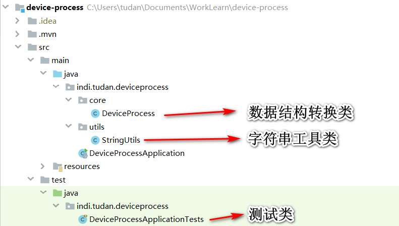

# device-process

用于设备数据分组加工。

处理过程详见 *indi.tudan.deviceprocess.core.DeviceProcess*；测试代码详见 *indi.tudan.deviceprocess.DeviceProcessApplicationTests*。

本示例提供了两种解决方案，processWithMap() 使用 jdk HashMap；processWithJson() 使用 fastjson；若您用了其他的数据对象类，参照修改即可。

@description jdk 1.8 及以上

@author wangtan

@date 2019-10-26 17:05:46

@since 1.0

思路：先按照**设备编号**分组，再按照**周期**分组。**请考虑待分组属性为空的情况**。

注意：使用 Collectors.groupingBy 的时候， **分组属性千万不能为 null**。遇到这种情况，可以做类型转换；或者使用 filter 将 null 过滤掉。





### 1、原始数据结构

```json
[{
	"machineCode": "testdelete001",
	"machineName": "设备000011",
	"maintainInterval": 0,
	"dateList": [1568545050000]
}, {
	"machineCode": "testdelete001",
	"machineName": "设备000011",
	"maintainInterval": 1,
	"dateList": [1568545070000]
}, {
	"machineCode": "testdelete001",
	"machineName": "设备000011",
	"maintainInterval": 1,
	"dateList": [1568545060000]
}, {
	"machineCode": "shebeibangdtest001",
	"machineName": "设备绑定测试001",
	"maintainInterval": 0,
	"dateList": [1568279597000]
}, {
	"machineCode": "SDL-001",
	"machineName": "离心机001",
	"maintainInterval": 0,
	"dateList": [1571824443000]
}, {
	"machineCode": "HT-001",
	"machineName": "选籽机001",
	"maintainInterval": 0,
	"dateList": [1571824443000, 1571846401000]
}, {
	"machineCode": "FZJ-001",
	"machineName": "纺织机001",
	"maintainInterval": null,
	"dateList": [null]
}, {
	"machineCode": "2",
	"machineName": "阿诗丹顿",
	"maintainInterval": 0,
	"dateList": [1571397603000, 1571825190000, 1571882705000]
}, {
	"machineCode": "3",
	"machineName": "阿诗丹顿3",
	"maintainInterval": 1,
	"dateList": [1571193334000]
}]
```

### 2、处理后的数据结构（去掉 null）

```json
[{
	"machineCode": "HT-001",
	"intervalGroup": [{
		"maintainInterval": 0,
		"dateList": [1571824443000, 1571846401000]
	}],
	"machineName": "选籽机001"
}, {
	"machineCode": "2",
	"intervalGroup": [{
		"maintainInterval": 0,
		"dateList": [1571397603000, 1571825190000, 1571882705000]
	}],
	"machineName": "阿诗丹顿"
}, {
	"machineCode": "testdelete001",
	"intervalGroup": [{
		"maintainInterval": 0,
		"dateList": [1568545050000]
	}, {
		"maintainInterval": 1,
		"dateList": [1568545070000, 1568545060000]
	}],
	"machineName": "设备000011"
}, {
	"machineCode": "3",
	"intervalGroup": [{
		"maintainInterval": 1,
		"dateList": [1571193334000]
	}],
	"machineName": "阿诗丹顿3"
}, {
	"machineCode": "shebeibangdtest001",
	"intervalGroup": [{
		"maintainInterval": 0,
		"dateList": [1568279597000]
	}],
	"machineName": "设备绑定测试001"
}, {
	"machineCode": "SDL-001",
	"intervalGroup": [{
		"maintainInterval": 0,
		"dateList": [1571824443000]
	}],
	"machineName": "离心机001"
}]
```
